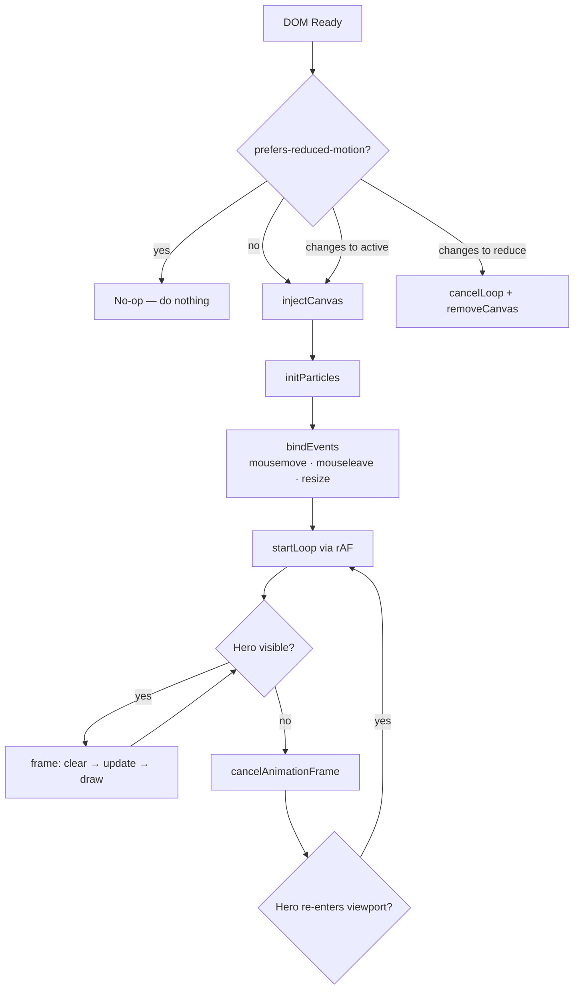

# Design Document — Hero Mouse Animation

## Overview

This feature adds a canvas-based particle constellation animation to `header#hero`. A field of floating particles drifts autonomously; particles near the cursor are repelled outward; nearby particles are connected by faint lines. The effect is implemented in a single self-contained vanilla JS file (`hero-animation.js`) with no external dependencies.

The design integrates with the existing portfolio without touching any existing CSS, HTML attributes, or JS globals. It respects `prefers-reduced-motion` and pauses via `IntersectionObserver` when the hero is off-screen.

## Architecture

The animation is driven by a single IIFE in `hero-animation.js`. All state lives inside that closure. The module follows a straightforward init → loop → teardown lifecycle.



### Key Design Decisions

- **Single file, IIFE scope** — keeps zero global pollution and matches the existing `main.js` pattern.
- **rAF-only loop** — satisfies Requirement 5.1 and is the standard for smooth 60 fps canvas work.
- **IntersectionObserver pause/resume** — reuses the same observer pattern already in `main.js`, pausing the loop when the hero scrolls out of view.
- **matchMedia listener** — a single `addEventListener('change', …)` on the media query object handles live reduced-motion toggling (Requirements 6.2, 6.3).
- **O(n²) line evaluation** — with n capped at 120 particles this is at most 7 140 distance checks per frame, well within budget for a 60 fps loop.

## Components and Interfaces

### AnimationController (IIFE)

The single exported behaviour is the side-effect of loading the script. Internally the module exposes no public API.

```
AnimationController
  ├── init()              — entry point called on DOMContentLoaded
  ├── injectCanvas()      — creates <canvas>, sets aria-hidden, appends to hero
  ├── resizeCanvas()      — syncs canvas pixel dims to hero clientWidth/clientHeight
  ├── initParticles()     — allocates particle array (80–120 items)
  ├── startLoop()         — calls requestAnimationFrame(frame)
  ├── stopLoop()          — calls cancelAnimationFrame(rafHandle)
  ├── frame(ts)           — clear → updateParticles → drawLines → drawParticles → rAF
  ├── updateParticles()   — apply drift + repulsion + edge-wrap per particle
  ├── drawLines()         — O(n²) proximity check + strokeStyle per pair
  ├── drawParticles()     — fillStyle per particle
  ├── onMouseMove(e)      — records cursor pos relative to canvas
  ├── onMouseLeave()      — clears cursor pos
  └── onResize()          — debounced resizeCanvas + re-scatter particles
```

### Particle Object

```js
{
  x:       number,   // current x position (px)
  y:       number,   // current y position (px)
  vx:      number,   // current x velocity (px/frame)
  vy:      number,   // current y velocity (px/frame)
  baseVx:  number,   // idle drift x velocity (constant after init)
  baseVy:  number,   // idle drift y velocity (constant after init)
  r:       number,   // radius 1–2.5 px
  opacity: number,   // 0.4–0.9
}
```

### Canvas Element

Injected as `header#hero`'s first child:

```html
<canvas
  id="hero-particle-canvas"
  aria-hidden="true"
  style="position:absolute;inset:0;z-index:0;pointer-events:none;"
></canvas>
```

`pointer-events: none` ensures mouse events fall through to the hero element itself (where the `mousemove` listener lives), not the canvas.

## Data Models

### Module-level State

```js
let canvas, ctx;           // HTMLCanvasElement, CanvasRenderingContext2D
let particles = [];        // Particle[]
let rafHandle = null;      // rAF id
let cursor = null;         // { x, y } | null
const PARTICLE_COUNT = 100;        // chosen once at init (rand 80–120)
const CONNECTION_DIST = 120;       // px
const REPULSION_DIST  = 100;       // px
const RESTORE_FRAMES  = 60;        // frames to return to idle drift
```

### Constants

| Constant | Value | Source |
|---|---|---|
| `CONNECTION_DIST` | 120 px | Req 3.1 |
| `REPULSION_DIST` | 100 px | Req 4.2 |
| `RESTORE_FRAMES` | 60 frames | Req 4.4 |
| `MIN_PARTICLES` | 80 | Req 2.1 |
| `MAX_PARTICLES` | 120 | Req 2.1 |
| `MIN_RADIUS` | 1 px | Req 2.2 |
| `MAX_RADIUS` | 2.5 px | Req 2.2 |
| `MIN_OPACITY` | 0.4 | Req 2.2 |
| `MAX_OPACITY` | 0.9 | Req 2.2 |
| `MIN_SPEED` | 0.2 px/frame | Req 2.3 |
| `MAX_SPEED` | 0.6 px/frame | Req 2.3 |
| `ACCENT` | `#BF5700` | Req 2.5, 3.3 |
| `LINE_WIDTH` | 0.5 px | Req 3.3 |

### Repulsion Algorithm

Each frame, for every particle within `REPULSION_DIST` of the cursor:

```
dx = particle.x - cursor.x
dy = particle.y - cursor.y
dist = sqrt(dx² + dy²)
force = (REPULSION_DIST - dist) / REPULSION_DIST   // 0..1, stronger when closer
particle.vx += (dx / dist) * force * REPULSION_STRENGTH
particle.vy += (dy / dist) * force * REPULSION_STRENGTH
```

Velocity is then lerped back toward `(baseVx, baseVy)` every frame by a small factor (`1/RESTORE_FRAMES`), satisfying the 60-frame restoration requirement.

### Edge Wrapping

```
if (particle.x < 0)            particle.x = canvas.width
if (particle.x > canvas.width) particle.x = 0
if (particle.y < 0)            particle.y = canvas.height
if (particle.y > canvas.height) particle.y = 0
```

## Correctness Properties

*A property is a characteristic or behavior that should hold true across all valid executions of a system — essentially, a formal statement about what the system should do. Properties serve as the bridge between human-readable specifications and machine-verifiable correctness guarantees.*


### Property 1: Canvas dimensions match hero dimensions

*For any* hero element with any clientWidth and clientHeight (including after a resize event), the canvas pixel dimensions SHALL equal the hero's clientWidth and clientHeight.

**Validates: Requirements 1.3, 1.4**

### Property 2: Particle field invariants

*For any* particle produced by `initParticles()`, the particle's radius SHALL be in [1, 2.5] px, its opacity SHALL be in [0.4, 0.9], and its idle drift speed (`sqrt(baseVx² + baseVy²)`) SHALL be in [0.2, 0.6] px/frame.

**Validates: Requirements 2.2, 2.3**

### Property 3: Particle count in range

*For any* call to `initParticles()`, the resulting particle array length SHALL be between 80 and 120 inclusive.

**Validates: Requirements 2.1**

### Property 4: Edge wrapping

*For any* particle placed at any position outside the canvas bounds (x < 0, x > width, y < 0, y > height), after one call to `updateParticles()` the particle SHALL appear at the corresponding opposite edge.

**Validates: Requirements 2.4**

### Property 5: Constellation lines drawn for proximate pairs

*For any* two particles whose Euclidean distance is less than 120 px, `drawLines()` SHALL invoke a stroke operation for that pair; for any two particles whose distance is ≥ 120 px, no stroke SHALL be drawn between them.

**Validates: Requirements 3.1**

### Property 6: Line opacity proportional to proximity

*For any* pair of particles at distance d ∈ [0, 120), the strokeStyle alpha applied to their Constellation_Line SHALL equal `(120 - d) / 120`.

**Validates: Requirements 3.2**

### Property 7: Cursor position recorded accurately

*For any* mousemove event fired over the hero with coordinates (x, y) relative to the canvas, the module's internal cursor record SHALL equal `{ x, y }` after the event is processed.

**Validates: Requirements 4.1**

### Property 8: Repulsion force inversely proportional to distance

*For any* two particles at distances d1 < d2 < 100 px from the cursor, the repulsion force magnitude applied to the particle at d1 SHALL be strictly greater than the force applied to the particle at d2; and *for any* particle at distance ≥ 100 px from the cursor, no repulsion force SHALL be applied.

**Validates: Requirements 4.2, 4.3**

### Property 9: Velocity restored to idle drift within 60 frames

*For any* particle that has been repelled from its idle drift velocity, after 60 calls to `updateParticles()` with `cursor = null`, the particle's velocity SHALL be within a small epsilon (≤ 0.01 px/frame) of its original `(baseVx, baseVy)`.

**Validates: Requirements 4.4**

### Property 10: Render loop pauses and resumes with hero visibility

*For any* IntersectionObserver callback where `isIntersecting` is `false`, the active rAF handle SHALL be cancelled; *for any* callback where `isIntersecting` is `true`, a new rAF SHALL be scheduled.

**Validates: Requirements 5.2**

### Property 11: O(n²) line evaluation

*For any* particle count n, the number of unique particle-pair distance evaluations performed by `drawLines()` in a single frame SHALL equal `n * (n - 1) / 2`.

**Validates: Requirements 5.4**

## Error Handling

| Scenario | Handling |
|---|---|
| `header#hero` not found in DOM | Guard at init: early return, no canvas injected, no errors thrown |
| `getContext('2d')` returns null (unsupported browser) | Guard after canvas creation: early return, canvas removed |
| `clientWidth` or `clientHeight` is 0 at init | Canvas created with 0 dimensions; resize event will correct on next layout |
| mousemove fires with no canvas in DOM | Cursor update is a no-op (cursor variable stays null) |
| IntersectionObserver not supported | Feature-detect; fall back to always-running loop |
| matchMedia not supported | Feature-detect; skip reduced-motion listener, animation always runs |

All errors are silent (no `console.error` in production) — the animation is purely decorative and failure should be invisible to the user.

## Testing Strategy

### Unit Tests (example-based)

Cover specific structural and rendering assertions that don't benefit from input variation:

- Canvas is injected as first child of `header#hero` with `aria-hidden="true"` and correct inline styles (Req 1.1, 1.2, 1.5)
- `ctx.clearRect` is called once per frame (Req 5.3)
- Constellation lines use stroke width 0.5 px and accent colour `#BF5700` (Req 3.3)
- Particles are rendered using accent colour with per-particle opacity (Req 2.5)
- `cursor` is set to `null` after `mouseleave` (Req 4.5)
- No canvas injected when `prefers-reduced-motion: reduce` is active at load (Req 6.1)
- Canvas removed and rAF cancelled when reduced-motion activates mid-session (Req 6.2)
- Canvas reinitialised and loop restarted when reduced-motion deactivates (Req 6.3)
- DOM state outside `header#hero` is unchanged after `init()` (Req 7.2, 7.5)

### Property-Based Tests

Property-based testing applies here because the core logic (particle physics, geometry, rendering decisions) consists of pure functions whose correctness must hold across a wide input space. The library of choice is **fast-check** (JavaScript, zero dependencies, works in any test runner).

Each property test runs a minimum of **100 iterations**.

Tag format: `// Feature: hero-mouse-animation, Property N: <property text>`

| Property | What varies | fast-check arbitraries |
|---|---|---|
| P1: Canvas dims match hero | hero width, hero height | `fc.integer({ min: 100, max: 3000 })` |
| P2: Particle field invariants | random seed / particle index | `fc.integer()` as seed |
| P3: Particle count in range | random seed | `fc.integer()` as seed |
| P4: Edge wrapping | particle position, canvas size | `fc.float`, `fc.integer` |
| P5: Lines drawn for proximate pairs | particle positions | `fc.float` for x, y |
| P6: Line opacity proportional to proximity | distance value | `fc.float({ min: 0, max: 119.99 })` |
| P7: Cursor position recorded | event x, y | `fc.integer` for coords |
| P8: Repulsion force inversely proportional | particle pos, cursor pos | `fc.float` for positions |
| P9: Velocity restored within 60 frames | initial repulsion state | `fc.float` for velocity deltas |
| P10: Loop pauses/resumes with visibility | isIntersecting boolean | `fc.boolean()` |
| P11: O(n²) evaluation | particle count n | `fc.integer({ min: 80, max: 120 })` |

### Smoke Tests

- No `setInterval` or `setTimeout` calls in `hero-animation.js` (Req 5.1) — static grep
- No new properties on `window` after script loads (Req 7.4)
- `<script src="hero-animation.js">` appears after `<script src="main.js">` in `index.html` (Req 7.1)
